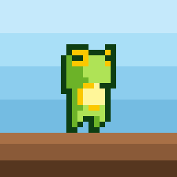
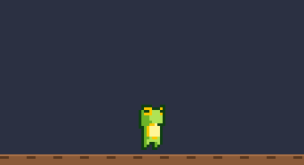
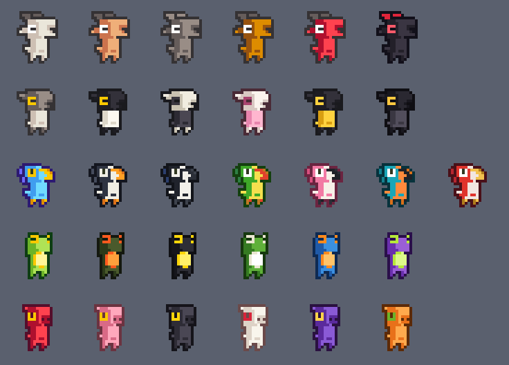

<div align="center">



# Offiky

**같은 네트워크에 있는 동료들의 픽셀 캐릭터가 내 화면 바닥을 돌아다닌다.**

[](https://github.com/supungbab/offiky/releases)
[](https://www.apple.com/macos/)
[](https://swift.org)
[](https://github.com/supungbab/homebrew-tap)
[](LICENSE)



</div>

## 왜

- **사무실에 사람이 있다는 감각.** 옆자리가 비어 있어도 화면 아래에 동료가 걸어 다닌다.
- **켜 두면 끝이다.** 계정도 서버도 없다. 같은 네트워크에 있으면 서로를 발견한다.
- **일을 방해하지 않는다.** 메뉴바에만 상주하고 Dock 에는 뜨지 않는다. 클릭은 전부 아래 창으로 통과한다.

## 쓰는 법

| | |
|---|---|
| **채팅** | `⌥F` — 화면 아래 입력창이 뜬다. 엔터로 보내면 머리 위 말풍선에 5초간 표시된다 |
| **조종** | `⌥D` — `←` `→` 이동, 같은 방향을 빠르게 두 번 누르면 대시, `↑` 점프, 공중에서 한 번 더 누르면 2단 점프, `esc` 로 끝낸다 |
| **옮기기** | 마우스로 캐릭터를 집어서 놓는다. 공중에서 놓으면 떨어진다 |
| **꾸미기** | 메뉴 → 내 캐릭터… — 30종 중에 고른다 |
| **이름** | 메뉴 → 내 이름 변경… — 기본값은 맥 계정 이름이다 |
| **참가자** | 메뉴 → 참가자 N명… — 지금 보이는 사람 목록 |

조종하지 않는 동안 캐릭터는 제자리에 선다. 대시로 정면에서 부딪치거나 높은 곳에서
떨어지면 아파하는 동작이 나온다.

## 캐릭터



모양 다섯에 프리셋 여섯씩, **30종**이다. 세로가 모양(염소·양·새·개구리·돼지),
가로가 프리셋이다. 첫 칸은 원작자가 그린 그대로이고 나머지는 등·배·눈 같은 자리를
따로 칠한 것이다.

| 모양 | 프리셋 |
|---|---|
| 염소 | `white` `brown` `black` `gold` `red` `demon` |
| 양 | `grey` `suffolk` `ink` `candy` `fleece` `night` |
| 새 | `blue` `penguin` `magpie` `parrot` `flamingo` `kingfisher` |
| 개구리 | `green` `fire` `dart` `tree` `azure` `violet` |
| 돼지 | `red` `pink` `black` `ivory` `royal` `carrot` |

색은 지어내지 않았다. 원본 그림에 들어 있던 색 띠를 서로 옮겨 조합했다.

## 동작

한 캐릭터가 **24장**을 쓴다. 위에서부터 대기 · 걷기 · 피격 · 점프 · 준비 · 달리기이고,
차례로 4 · 6 · 4 · 3 · 1 · 6장이다. 재생 속도도 동작마다 다르다 — 대기 5fps, 걷기 12,
피격 14, 점프 11, 달리기 18. 준비 자세는 달리기에 들어서는 순간 0.1초만 나온다.

맨 위 움직이는 그림은 `scripts/make_gifs.py` 가 이 시트에서 만든다. 앱이 실제로 쓰는
값을 그대로 쓴다 — 걷기 70pt/s, 대시 180pt/s, 중력 1100. 점프 정점 72pt 는 키의
1.5배라 도화지가 그만큼 높다.

## 설치

### 요구사항

**macOS 14 (Sonoma) 이상.** Apple Silicon 과 Intel 모두 동작한다.

### Homebrew

```bash
brew install --cask supungbab/tap/offiky
```

업데이트는 이렇게 한다.

```bash
brew update && brew upgrade --cask offiky
```

> **`brew update` 를 빼면 안 된다.** brew 는 tap 을 하루에 한 번만 다시 읽는다.
> 그 전에는 새 버전이 나온 줄 모르고 "이미 최신" 이라고 답한다.

### 직접 받기

[릴리스](https://github.com/supungbab/offiky/releases)에서 `Offiky.dmg` 를 받아
응용 프로그램 폴더로 드래그한 뒤, 터미널에서 한 번 실행한다.

```bash
xattr -dr com.apple.quarantine /Applications/Offiky.app
```

공증을 받지 않아 macOS 가 처음 실행을 막는다. Homebrew 로 설치하면 이 단계를
cask 가 대신 처리한다.

### 소스에서 빌드

```bash
git clone https://github.com/supungbab/offiky.git
cd offiky
xcodebuild -project offiky.xcodeproj -scheme offiky -configuration Release build
```

배포용 서명·패키징은 `scripts/release.sh` 가 한다. 아이콘은 `scripts/make_icon.py` 가
개구리 스프라이트를 직접 읽어 만든다.

## 어떻게 동작하나

| | |
|---|---|
| **발견** | Bonjour (`_offiky._tcp`). 같은 네트워크에 있으면 서로를 자동으로 찾는다 |
| **연결** | 서버도 중계자도 없다. **모두가 모두에게 직접 연결**한다 |
| **좌표** | 0.1초마다 보낸다. 받는 쪽은 최근 도착 간격에 맞춰 과거를 재생해 끊김을 메운다 |
| **좌표계** | 모든 화면을 왼쪽부터 한 줄로 늘어놓는다. 화면이 넓으면 그만큼 멀리까지 보인다 |

한 사람이 전원의 좌표를 받아 다시 뿌리던 방식을 버렸다. 그 사람만 인원의 제곱에
비례하는 양을 보내야 했고, 그 사람이 앱을 끄면 모두가 잠시 서로를 놓쳤다.

**모두 같은 버전을 설치해야 한다.** 통신 규약이 다르면 서로 보이지 않는다.
그런 동료가 있으면 메뉴가 알려 준다.

## 프라이버시 & 권한

- **로컬 네트워크 권한**이 필요하다. 처음 실행할 때 macOS 가 묻는다. 거부하면 서로를
  발견하지 못한다.
- **App Sandbox 안에서 동작한다.** 네트워크 연결과 수신만 허용되어 있고 파일 접근
  권한은 없다.
- **대화 내용은 어디에도 저장하지 않는다.** 말풍선은 5초 뒤 사라지고 기록이 남지 않는다.
  디스크에 쓰는 것은 내 이름, 고른 캐릭터 번호, 그리고 처음 켤 때 만드는 설치 식별자뿐이다.
  식별자는 캐릭터를 아직 안 골랐을 때 기본값을 정하는 데만 쓴다.
- **바깥으로 나가는 통신은 하나뿐이다** — 새 버전이 있는지 GitHub 에 묻는 것. 그때도
  보내는 정보는 없다.

## 라이선스 & 출처

코드는 [MIT](LICENSE) 다.

캐릭터 그림은 [ChaosWitchNikol](https://chaoswitchnikol.itch.io) 의 작품이다.

- [Goat Characters](https://chaoswitchnikol.itch.io/goat-characters) — 염소
- [Animal Characters](https://chaoswitchnikol.itch.io/animal-characters) — 새, 양, 개구리, 돼지

두 팩 모두 [CC BY 4.0](https://creativecommons.org/licenses/by/4.0/) 이다.
**원본을 그대로 쓰지 않고 색을 바꿔 표시한다.** 받은 그림 아홉은 그대로 두고,
등·배·눈 같은 자리를 따로 칠해 모양마다 프리셋 여섯을 만들었다.

각 캐릭터의 팔레트와 24장 전체 도트 지도는 [`characters.txt`](characters.txt) 에 있다.
